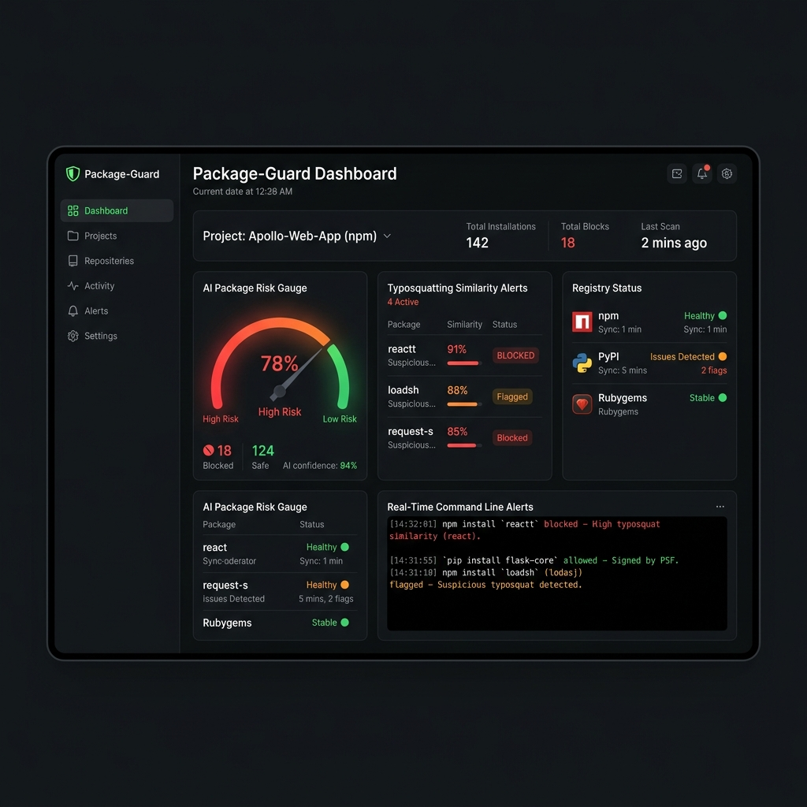

# 📦 Package-Guard
> **AI Package Hallucination Firewall & Typosquat Interceptor for Autonomous Coding Agents**

Package-Guard is a zero-trust package installation firewall designed to secure development systems against package hallucinations (slopsquatting) and typosquatting attacks initiated by autonomous coding agents (like Claude Code, Cursor, Windsurf, or Codex).



---

## 1. What This Project Is About
Package-Guard secures your supply chain by intercepting package installation commands (`npm install`, `pip install`) before they execute. It dynamically analyzes package metadata, registry existence, download counts, and typosquatting characteristics to identify whether the agent is installing a real, verified library or a hallucinated package containing malicious software.

---

## 2. The Problem Statement
As developers delegate work to autonomous coding agents, a dangerous new vector called **Slopsquatting** has emerged:

*   **AI Package Hallucinations**: Large Language Models (LLMs) frequently hallucinate package names that do not exist (e.g. `langchain-openai-utils-v2`).
*   **The Attack Vector**: Threat actors monitor LLM outputs or register common hallucinated names on public registries (npm, PyPI) with embedded malware (e.g. keyloggers, token stealers).
*   **Automatic Installation**: Autonomous agents run `npm install` or `pip install` silently in the background, executing the malicious package under the user's host privileges without any validation.
*   **No Protection**: Traditional tools like `npm audit` or `pip check` only verify known vulnerabilities in *existing* packages; they cannot detect that a package was hallucinated and pre-registered by an attacker.

---

## 3. How We Solve This Problem
Package-Guard places a **Security Interceptor** at the command-line layer. When the agent tries to install a package, Package-Guard intercepts the call and runs it through a 4-Layer Inspection Pipeline:

1.  **Registry Existence Audit**: Queries the npm or PyPI registry APIs. If a package doesn't exist, it blocks the install immediately.
2.  **Typosquatting Distance Evaluator**: Computes string similarity using Levenshtein distance metrics against the top 100+ most popular libraries. Warns/blocks if a package is suspiciously close to a popular dependency (e.g. `lodahs` -> `lodash`, `reqeusts` -> `requests`).
3.  **Metadata Reputation Engine**: Evaluates package age, weekly downloads, and publisher account flags. Newly published packages (less than 7 days old) or packages with zero downloads are blocked or flagged for review.
4.  **Policy Guardrails**: Restricts actions based on configured parameters in `policy.json` (such as blocking all packages below a specific age or download threshold).

---

## 4. How It Works

### Flow Diagram
```
 Agent writes:  npm install langchain-openai-utils-v2
                          │
                          ▼
            [Package-Guard CLI Interceptor]
                          │
                          ▼
        ┌────────────────────────────────────────────────────────┐
        │  Layer 1: Registry Existence Check                    │
        │           → npm registry API lookup                    │
        │           → NOT FOUND → BLOCK                          │
        │                                                        │
        │  Layer 2: Typosquatting Similarity Engine              │
        │           → 67% similar to "lodash"                    │
        │           → TYPOSQUAT DETECTED → BLOCK                 │
        │                                                        │
        │  Layer 3: Reputation & Age Check                       │
        │           → 2 days old, 3 downloads                    │
        │           → CRITICAL THREAT → BLOCK                    │
        └─────────────────────────┬──────────────────────────────┘
                                  │
                                  ├─► [BLOCK] ──► Cancel command + Exit 1
                                  │
                                  └─► [ALLOW] ──► Forward to npm/pip binary
```

---

## 5. How To Use This For Your Use Case

### Scenario A: Securing Your Terminal
Alias your package manager commands to Package-Guard:
```bash
alias npm="node /path/to/packageguard/packages/cli/dist/index.js npm"
alias pip="node /path/to/packageguard/packages/cli/dist/index.js pip"
```
Whenever you or an AI agent runs `npm install <package>`, it automatically routes through Package-Guard. 

### Scenario B: CI/CD Pipeline Gatekeeper
Integrate the batch API (`/check/batch`) in your CI/CD pipelines to block builds if an agent commits dependencies that fail safety thresholds.

---

## 6. How to Set Up and Run

### Prerequisites
*   **Node.js**: v20.0.0 or higher
*   **npm**: v10.0.0 or higher

### Step 1: Clone and Install
```bash
git clone https://github.com/Ishva24/Package-Guard---For-AI-Agents.git
cd Package-Guard---For-AI-Agents
npm install
```

### Step 2: Build the Modules
```bash
npm run build
```

### Step 3: Start the Security Server
Start the background policy gateway and SSE log broadcaster:
```bash
node packages/core/dist/server.js
```
The server will boot on port `7171` to avoid conflicting with common service ports.

### Step 4: Access the Observability Dashboard
Navigate to **[http://localhost:7171](http://localhost:7171)** in your browser. Here you can:
*   Use the **Package Inspector** to manually run checks.
*   Click **Test Presets** to see the pipeline intercept attacks (e.g. typosquats of lodash, react, requests).
*   View live stats (Allowed vs. Blocked packages) and the visual risk gauge.

### Step 5: Test via Command Line
Run installations using the CLI interceptor:
```bash
# Legitimate package (ALLOWED)
node packages/cli/dist/index.js npm install lodash --dry-run

# Hallucinated package (BLOCKED)
node packages/cli/dist/index.js npm install langchain-openai-utils-v2 --dry-run
```

---

## 🧪 Running Tests
To run unit tests for similarity checking and reputation scoring:
```bash
npm test
```

---

## 🛡️ License
MIT License. Keep your AI agents secure!
